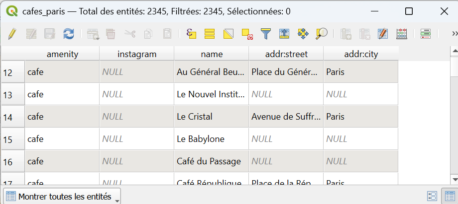
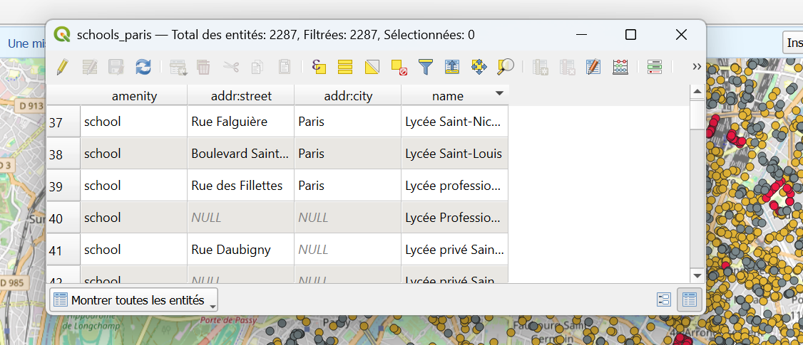
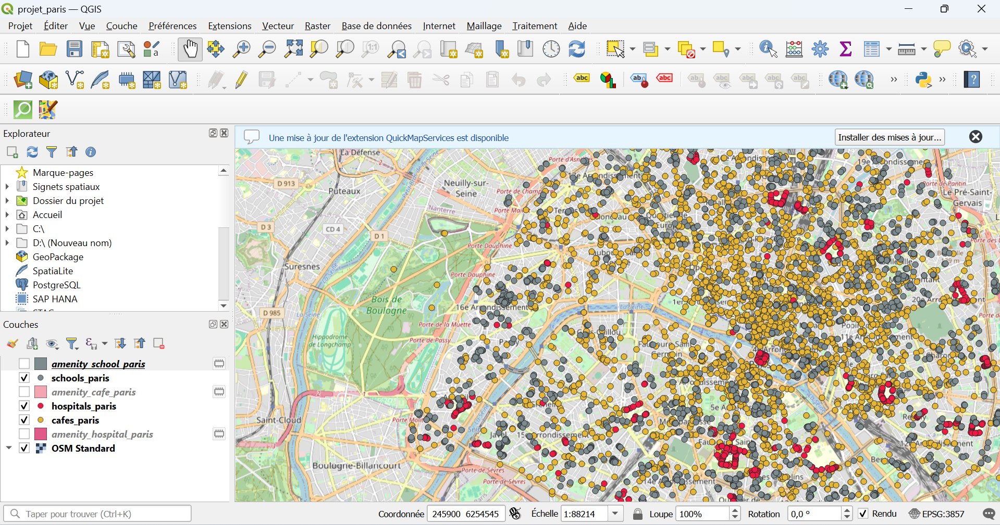

# 🗺️ Paris POI Explorer — QGIS + Leaflet

## 📖 Description
Ce projet est un **mini-système d’information géographique (SIG)** réalisé avec **QGIS** et des outils **open source**.  
Il a pour objectif de créer une **carte web interactive** de la ville de **Paris**, affichant trois types de points d’intérêt (POI) :  
- 🏥 **Hôpitaux**  
- ☕ **Cafés**  
- 🏫 **Écoles**

La carte est générée avec le plugin **qgis2web** et affichée avec **Leaflet.js** dans une page web.

---

## ⚙️ Outils utilisés
- [QGIS](https://qgis.org) — logiciel SIG open source  
- **Plugins QGIS** :  
  - *QuickMapServices* → ajouter des fonds de carte (OpenStreetMap)  
  - *QuickOSM* → extraction des données depuis OpenStreetMap  
  - *qgis2web* → export en carte web interactive (Leaflet)  
- **OpenStreetMap (OSM)** → source des données  
- **Leaflet.js** → bibliothèque JavaScript pour cartes interactives  
- **Turf.js** → calculs géospatiaux (distances, POI proches)  
- **Photon API** → recherche d’adresses (géocodage)

## 🚀 Étapes du projet

### 1. Préparation
- Installation de **QGIS**.  
- Création du projet `projet_paris.qgz`.  
- Ajout du fond de carte OSM Standard (*QuickMapServices*).  

### 2. Extraction des données
- Avec **QuickOSM**, requêtes pour Paris :  
  - `amenity=school`  
  - `amenity=hospital`  
  - `amenity=cafe`  
- Résultat : trois couches (écoles, hôpitaux, cafés).

### 3. Nettoyage
- Suppression des champs inutiles.  
- Conservation de : `name`, `amenity`, `addr:street`, `addr:city`.  
- Export en **GeoJSON** :  
  - `schools_paris.geojson`  
  - `hospitals_paris.geojson`  
  - `cafes_paris.geojson`

### 4. Stylisation
- Couleurs attribuées :  
  - 🏫 Écoles → vert  
  - 🏥 Hôpitaux → rouge  
  - ☕ Cafés → orange  

---

### 5. Export web
- Plugin **qgis2web** : choix **Leaflet**.  
- Configuration des popups (`name`, `amenity`).  
- Export → génération du dossier web avec `index.html`.

### 6. Page interactive
Fonctionnalités :  
- Fond de carte **OSM**  
- Points colorés par type  
- Popups cliquables avec infos  
- Légende interactive (activer/désactiver couches)  
- Assistant latéral (JavaScript) avec :  
  - Comptage des POI visibles dans la vue  
  - Recherche du **plus proche POI** autour du centre  
  - Géocodage Photon (ex: “cafés à 500 m de Notre-Dame”)  

## 🔎 Résultat
Une **carte interactive Leaflet** :  
- Accessible en local (ouvrir `index.html` dans un navigateur).  
- Ou en ligne via **GitHub Pages**.

## pour acceder au site web : https://paris-poi-explore.vercel.app/

